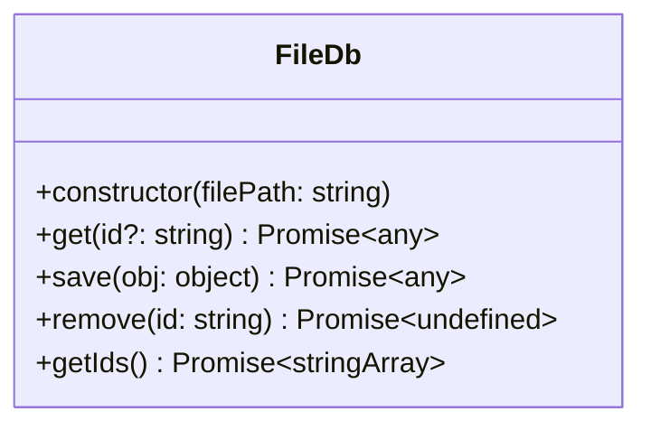

# @tomsd/fsdb

It is a storage in a file.


[](https://www.npmjs.com/package/@tomsd/fsdb)

## install
``` shell
npm install @tomsd/fsdb
```

## interfaces


``` typescript
import { FileDb } from "@tomsd/fsdb";

const filePath = "path/to/file";
const db = new FileDb(filePath);

// getting all data
console.log(await db.get()); // {} empty object for no data saved

// saving data
console.log(
  await db.save({
    some: "thing"
  })
); // { _id: xxxxxx, some: "thing" }

// getting all data again
console.log(await db.get());
/*
{
  xxxxx: {
    _id: xxxxx,
    some: "thing"
  }
}
*/

// getting one data by id
console.log(await db.get("xxxxx")); // { _id: "xxxxx", some: "thing" }

// removing data
await db.remove("xxxxx");

// drop(file will be deleted)
await db.drop();

```
